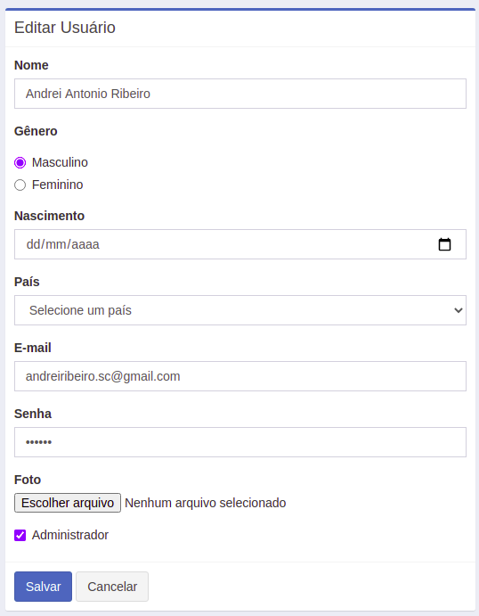

# FULLSTACK-NodeJsClient
Serviço responsável por disponibilizar página na web e manipular objetos DOM.

Este projeto tem como objetivo exercitar a manipulação de objetos do DOM via javascript no frontend, e o processamento das rotas de requisições executas por estes  objetos com NodeJs no backend.

Para o frontend foi ultilizado um template do https://adminlte.io/ e implementado assim a lógica via javascript das ações executadas na tela.

No backend utilizo o express-generator para criar a estrututra do servidor web e mapear as rotas de requisição.

Este projeto esta integrado com o projeto https://github.com/andreiRibeiro/BACKEND-NodeJsServer que eh o web-service responsável por processar as regras de negócio em conjunto com o banco de dados solicitadas por este web-service.

#### 1) Arquitetura de funcionamento.

#### 2) O sistema disponibiliza um formulário para cadastro de novos usuários, com validação de campos obrigatórios.

#### 3) Eh possível editar/excluir um usuário.

#### 4) O sistema disponibiliza a listagem dos usuarios com seus respectivos perfis.

